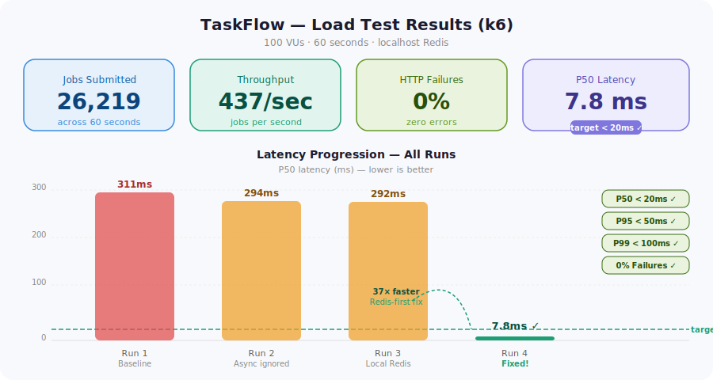
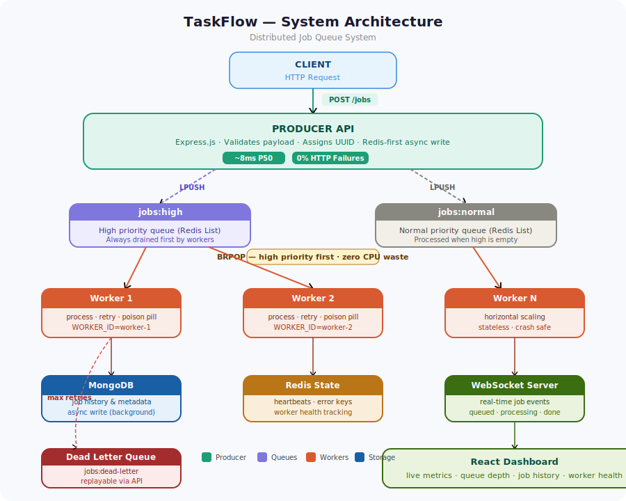
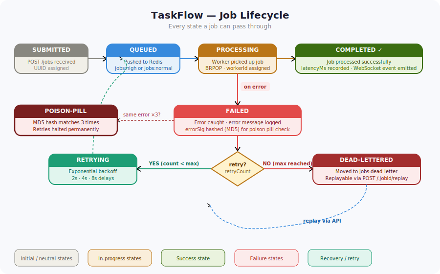

# ⚡ TaskFlow — Distributed Job Queue System

> A production-grade distributed background job processing system built with Node.js, Redis, and MongoDB. Decouples slow tasks from the main request-response lifecycle using async workers, priority queues, retry logic, and real-time monitoring.

---

## 📊 Load Test Results (k6)

| VUs | Throughput | P50 | P95 | P99 | HTTP Failures | Requests |
|-----|-----------|-----|-----|-----|---------------|----------|
| 100 | **437 jobs/sec** | **7.8 ms** ✅ | **41.8 ms** ✅ | **< 100 ms** ✅ | **0%** | 26,000+ |



> **Key optimization**: Switching from synchronous MongoDB writes to an **async Redis-first architecture** dropped P50 from 292 ms → 7.8 ms (**37× faster**). All latency thresholds passed at 100 VUs.

---

## 🏗️ System Architecture



---

## 🔄 Job Lifecycle



---

## ✨ Core Features

### 🔴 Priority Queues
Two Redis lists. Workers always drain `jobs:high` before `jobs:normal` using `BRPOP`.

### 🔁 Retry with Exponential Backoff
```
Attempt 1 failed → wait 2s  → retry
Attempt 2 failed → wait 4s  → retry
Attempt 3 failed → wait 8s  → dead-letter queue
```

### ☠️ Dead Letter Queue
Jobs exceeding `MAX_RETRIES` move to `jobs:dead-letter`. Replay via `POST /jobs/:jobId/replay`.

### 🧪 Poison Pill Detection
MD5 hash of error messages compared across last 3 failures. Identical errors → `poison-pill` status, retries stop permanently.

### 💓 Worker Heartbeats
Every worker writes to Redis every 2 seconds with `lastSeen`, `jobsProcessed`, `currentJobId`, `uptimeMs`.

### 📡 Real-Time Dashboard
WebSocket events on every job state change — no polling required.

### 🔍 Structured Logging (Winston)
```
2026-04-04 22:27:26 [info]  Worker started    | worker=worker-1
2026-04-04 22:27:27 [info]  Job processing    | jobId=abc-123 | worker=worker-1 | attempt=0
2026-04-04 22:27:29 [info]  Job completed     | jobId=abc-123 | latencyMs=2041
2026-04-04 22:27:30 [warn]  Job retrying      | jobId=xyz-789 | attempt=1 | delayMs=2000
2026-04-04 22:27:38 [error] Job dead lettered  | jobId=xyz-789
```

---

## 🛠️ Tech Stack

| Layer | Technology | Why |
|-------|-----------|-----|
| API Server | Node.js + Express | Non-blocking I/O, fast under concurrent load |
| Queue | Redis (ioredis, BRPOP) | Sub-ms ops, blocking pop = zero CPU waste |
| Storage | MongoDB + Mongoose | Flexible schema for evolving job metadata |
| Real-time | WebSockets (ws) | Push events without polling overhead |
| Frontend | React + Vite + Recharts | Fast HMR, composable charts |
| Logging | Winston | Structured JSON for prod, pretty for dev |
| Load Testing | k6 | Scriptable VU simulation, custom metrics |

---

## 📁 Project Structure

```
taskflow/
├── producer/
│   ├── models/
│   │   └── job.js           # Mongoose schema (jobId, type, payload, status, retryCount...)
│   ├── routes/
│   │   ├── jobs.js          # POST /jobs (async), GET /jobs, replay
│   │   ├── stats.js         # GET /stats — queue depths + worker counts
│   │   └── workers.js       # GET /workers — heartbeat data
│   └── index.js             # Express server, WebSocket init
├── worker/
│   └── index.js             # BRPOP loop, retry, poison pill, heartbeat
├── shared/
│   ├── redis.js             # ioredis client
│   ├── mongo.js             # Mongoose connection
│   ├── websocket.js         # WS server + event emitter
│   └── logger.js            # Winston with job lifecycle helpers
├── dashboard/               # React frontend
├── tests/
│   ├── load.js              # k6 load test — 100 VUs, 60s, custom metrics
│   └── results/             # Auto-generated (gitignored)
├── .env.example
└── README.md
```

---

## 🚀 Running Locally

### Prerequisites
- Node.js 18+
- Redis (local) — Windows: [Memurai](https://memurai.com), Mac: `brew install redis`
- MongoDB Atlas or local MongoDB

### Setup

```bash
# 1. Clone
git clone https://github.com/vinaychandramola/taskflow.git
cd taskflow

# 2. Install
npm install

# 3. Configure
cp .env.example .env
# Edit .env with your Redis and MongoDB URLs

# 4. Start Redis (Windows)
D:\Software\memurai.exe --port 6379

# 5. Start producer
node producer/index.js

# 6. Start worker (new terminal)
node worker/index.js

# 7. Start dashboard (new terminal)
cd dashboard && npm install && npm run dev
```

### Scale workers
```bash
node worker/index.js                      # Terminal 1
WORKER_ID=worker-2 node worker/index.js   # Terminal 2
WORKER_ID=worker-3 node worker/index.js   # Terminal 3
```

---

## 📡 API Reference

### Submit a job
```http
POST /jobs
Content-Type: application/json

{
  "type": "send_email",
  "payload": { "userId": 123, "template": "welcome" },
  "priority": "high"
}
```
```json
{ "jobId": "550e8400-e29b-41d4-a716-446655440000", "status": "queued" }
```

### Get job history
```http
GET /jobs?limit=20
```

### Get single job
```http
GET /jobs/:jobId
```

### Replay dead-lettered job
```http
POST /jobs/:jobId/replay
```

### Queue stats
```http
GET /stats
```
```json
{
  "queues": { "high": 0, "normal": 0, "deadLetter": 2 },
  "workers": 3,
  "processed": 1482,
  "failed": 48
}
```

### Health check
```http
GET /health
```

---

## 🧪 Load Testing

### Install k6
```bash
choco install k6      # Windows
brew install k6       # Mac
```

### Run
```bash
# From project root
k6 run tests/load.js

# Custom host
BASE_URL=http://your-host:3000 k6 run tests/load.js
```

### What it tests
- 100 virtual users ramping up over 10s, holding 40s, ramping down 10s
- 5 job types (email, report, image, webhook, analytics) with random priorities
- Custom metrics: `job_queue_latency_ms`, `job_failure_rate`, `jobs_submitted`
- Thresholds: P50 < 20ms, P95 < 50ms, P99 < 100ms, failures < 1%

---

## ⚙️ Environment Variables

```bash
PORT=3000
NODE_ENV=development

REDIS_URL=redis://localhost:6379
MONGODB_URI=mongodb+srv://...

WS_PORT=3001

WORKER_ID=worker-1
MAX_RETRIES=3
JOB_TIMEOUT_MS=30000

LOG_LEVEL=info
LOG_FORMAT=pretty          # pretty (dev) | json (prod)
```

---

## 🔑 Key Engineering Decisions

**Redis-first, async MongoDB writes**
Original design awaited MongoDB before responding → P50 of 292ms. Fix: push to Redis, respond immediately (~1ms), write MongoDB in background. Result: P50 dropped to 7.8ms (37×).

**BRPOP over polling**
Workers block on Redis until a job arrives. Zero CPU usage on idle queues, immediate response when a job lands.

**Stateless workers**
No in-memory state. All state in Redis and MongoDB. Workers can crash and restart with zero data loss, and scale horizontally without coordination.

**Poison pill hashing**
MD5 of error message compared across last 3 attempts. Identical = structural failure, stop retrying. Prevents a bad job from consuming worker capacity indefinitely.

---

## 🔭 Future Scope

- [ ] Job scheduling (delayed/cron jobs)
- [ ] Rate limiting per job type
- [ ] Auto-scaling workers based on queue depth
- [ ] Job cancellation API
- [ ] Worker heartbeat failure detection and recovery
- [ ] Redis Streams migration (from Lists) for consumer groups

---

## 👤 Author

**Vinay Chand Ramola** — Software Engineer

[](https://github.com/vinaychandramola)